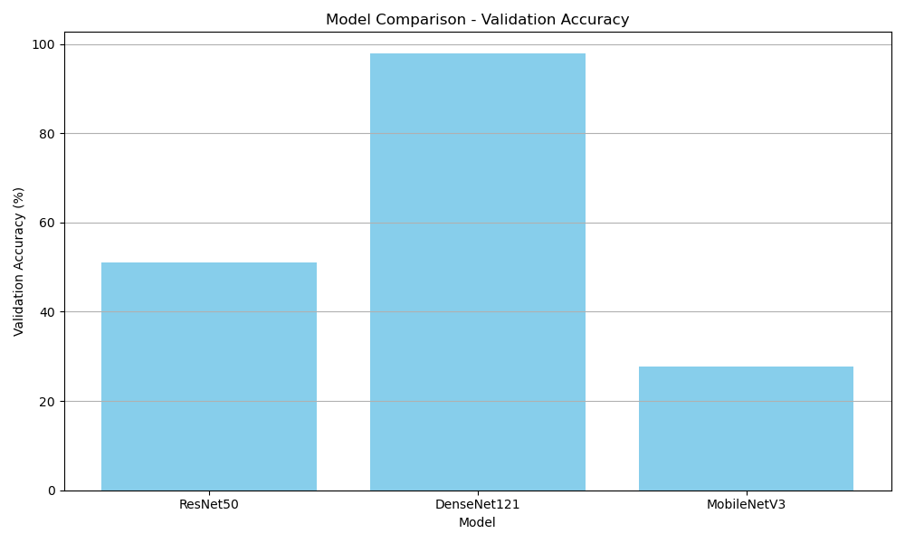

# 🌼 AI Flower Classification Project

An end-to-end deep learning project for classifying 10 different types of flowers using computer vision and transfer learning techniques.

## 📝 Project Overview

This project implements a comprehensive flower classification system using deep learning models. The system can identify and classify 10 different flower types with high accuracy using state-of-the-art convolutional neural networks.

### 🌸 Flower Classes
The model can classify the following flower types:
- 🌹 **Rose** - Classic garden roses in various colors
- 🌻 **Sunflower** - Bright yellow sunflowers
- 🌷 **Tulip** - Colorful spring tulips
- 🌼 **Dandelion** - Yellow wildflower dandelions
- 🌺 **Orchid** - Exotic tropical orchids
- 🌺 **Hibiscus** - Tropical hibiscus flowers
- 🪷 **Lily** - Elegant water and garden lilies
- 🪷 **Lotus** - Sacred lotus blossoms
- 🌸 **Jasmine** - Fragrant white jasmine flowers
- 💜 **Lavender** - Purple aromatic lavender

## 🏗️ Project Structure

```
ai-flower-project/
├── data/                          # Raw downloaded images
│   ├── dandelion/
│   ├── hibiscus/
│   ├── jasmine/
│   ├── lavender/
│   ├── lily/
│   ├── lotus/
│   ├── orchid/
│   ├── rose/
│   ├── sunflower/
│   └── tulip/
├── dataset/                       # Processed dataset splits
│   ├── train/                     # Training images (70%)
│   ├── val/                       # Validation images (20%)
│   └── test/                      # Test images (10%)
├── models/                        # Trained model files
│   ├── ResNet50.h5
│   ├── DenseNet121.h5
│   └── MobileNetV3.h5
├── notebooks/                     # Jupyter notebooks
│   └── ai_flower_classification_project.ipynb
├── output/                        # Results and visualizations
│   ├── confusion_matrix/          # Confusion matrices
│   ├── plots/                     # Performance plots
│   ├── download_stats.txt         # Dataset statistics
│   └── model_summary_with_mAP.csv # Model comparison results
├── requirements.txt               # Python dependencies
└── README.md                      # This file
```

## 📊 Dataset Information

- **Total Images**: 25,781 images across 10 flower classes
- **Data Collection**: Automated web scraping using Google Images API
- **Image Distribution**:
  - Rose: 2,779 images
  - Sunflower: 2,346 images
  - Tulip: 2,835 images
  - Dandelion: 2,652 images
  - Orchid: 2,821 images
  - Hibiscus: 2,592 images
  - Lily: 2,548 images
  - Lotus: 2,702 images
  - Jasmine: 2,184 images
  - Lavender: 2,322 images

## 🤖 Models Implemented

### Three different CNN architectures were trained and compared:

| Model | Validation Accuracy | mAP Score | Training Time | Parameters | Notes |
|-------|-------------------|-----------|---------------|------------|-------|
| **DenseNet121** | **97.81%** | **98.83%** | 12,167s | 8.0M | Best overall performance |
| ResNet50 | 50.97% | 60.15% | 11,411s | 25.0M | Baseline model |
| MobileNetV3 | 27.67% | 30.46% | 2,600s | 2.5M | Fastest training |

### 🏆 Best Performing Model: DenseNet121
- **Validation Accuracy**: 97.81%
- **mAP (Mean Average Precision)**: 98.83%
- **Architecture**: DenseNet121 with custom classification head
- **Input Size**: 224×224×3
- **Transfer Learning**: Pre-trained on ImageNet

## ⚙️ Technical Implementation

### Data Processing Pipeline
1. **Data Collection**: Automated image scraping using `icrawler`
2. **Data Cleaning**: Manual verification and duplicate removal
3. **Data Splitting**: 70% train / 20% validation / 10% test
4. **Data Augmentation**: Real-time augmentation during training
5. **Preprocessing**: Image normalization and resizing

### Model Architecture
```python
# DenseNet121 Architecture
base_model = DenseNet121(weights='imagenet', include_top=False, input_shape=(224,224,3))
model = Sequential([
    base_model,
    GlobalAveragePooling2D(),
    Dense(256, activation='relu'),
    Dense(10, activation='softmax')  # 10 flower classes
])
```

### Training Configuration
- **Optimizer**: Adam
- **Loss Function**: Categorical Crossentropy
- **Epochs**: 50
- **Batch Size**: 32
- **Learning Rate**: Default Adam settings
- **Transfer Learning**: Frozen pre-trained weights

## 🚀 Getting Started

### Prerequisites
- Python 3.8+
- CUDA-compatible GPU (recommended for training)
- 8GB+ RAM

### Installation

1. **Clone the repository**
   ```bash
   git clone https://github.com/yourusername/ai-flower-project.git
   cd ai-flower-project
   ```

2. **Create virtual environment**
   ```bash
   python -m venv venv
   venv\Scripts\activate  # Windows
   # source venv/bin/activate  # Linux/Mac
   ```

3. **Install dependencies**
   ```bash
   pip install -r requirements.txt
   ```

### Usage

#### Option 1: Run the Complete Notebook
```bash
jupyter notebook notebooks/ai_flower_classification_project.ipynb
```

#### Option 2: Use Pre-trained Models
```python
import tensorflow as tf
from tensorflow.keras.preprocessing import image
import numpy as np

# Load the best model
model = tf.keras.models.load_model('models/DenseNet121.h5')

# Predict on new image
def predict_flower(image_path):
    img = image.load_img(image_path, target_size=(224, 224))
    img_array = image.img_to_array(img) / 255.0
    img_array = np.expand_dims(img_array, axis=0)
    
    prediction = model.predict(img_array)
    class_names = ['dandelion', 'hibiscus', 'jasmine', 'lavender', 'lily', 
                   'lotus', 'orchid', 'rose', 'sunflower', 'tulip']
    
    predicted_class = class_names[np.argmax(prediction)]
    confidence = np.max(prediction) * 100
    
    return predicted_class, confidence

# Example usage
flower_type, confidence = predict_flower('path/to/your/flower/image.jpg')
print(f"Predicted: {flower_type} (Confidence: {confidence:.2f}%)")
```

## 📈 Results & Performance

### Model Comparison


### Key Findings
- **DenseNet121** achieved the best performance with 97.81% validation accuracy
- **Transfer Learning** was highly effective for this image classification task
- **Data Quality** played a crucial role in model performance
- **Balanced Dataset** with ~2,500 images per class ensured fair evaluation

### Confusion Matrix
The confusion matrices for each model are available in the `output/confusion_matrix/` directory, showing detailed per-class performance.

## 🛠️ Technologies Used

- **Deep Learning**: TensorFlow 2.10, Keras
- **Computer Vision**: OpenCV, PIL
- **Data Processing**: NumPy, Pandas
- **Visualization**: Matplotlib, Seaborn
- **Data Collection**: icrawler (Google Images API)
- **Model Evaluation**: scikit-learn
- **Development**: Jupyter Notebook, Python 3.8

## 📁 File Descriptions

- `notebooks/ai_flower_classification_project.ipynb`: Complete end-to-end implementation
- `requirements.txt`: Python package dependencies
- `models/`: Trained model weights (.h5 files)
- `output/model_summary_with_mAP.csv`: Detailed model performance metrics
- `output/download_stats.txt`: Dataset collection statistics

## 🔮 Future Improvements

- [ ] **Data Augmentation**: Implement more sophisticated augmentation techniques
- [ ] **Ensemble Methods**: Combine multiple models for better accuracy
- [ ] **Real-time Inference**: Deploy model for real-time classification
- [ ] **Mobile Deployment**: Optimize for mobile applications
- [ ] **Web Interface**: Create a user-friendly web application
- [ ] **Additional Classes**: Expand to more flower varieties
- [ ] **Fine-tuning**: Unfreeze and fine-tune pre-trained layers

## 🤝 Contributing

1. Fork the repository
2. Create a feature branch (`git checkout -b feature/amazing-feature`)
3. Commit your changes (`git commit -m 'Add amazing feature'`)
4. Push to the branch (`git push origin feature/amazing-feature`)
5. Open a Pull Request

## 📄 License

This project is licensed under the MIT License - see the [LICENSE](LICENSE) file for details.

## 🙏 Acknowledgments

- **ImageNet** for pre-trained model weights
- **TensorFlow/Keras** team for the excellent deep learning framework
- **Google Images** for providing the training data source
- **Open Source Community** for the amazing tools and libraries
---

⭐ **If you found this project helpful, please give it a star!** ⭐
